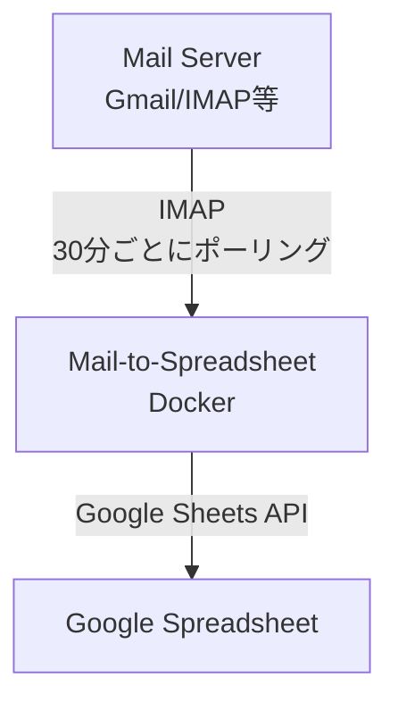

# Mail-to-Spreadsheet 設計書

## 概要
メールを検知してGoogle Spreadsheetに内容を転記するプログラム。
特定の件名を持つメールを受信したら、送信元メールアドレス、件名、受信日時などをGoogle Spreadsheetに自動記録する。


## 補足: 改善・運用・自動化

### crontab自動生成
- Dockerコンテナ起動時に `settings.yaml` の `check_interval_minutes` から自動でcrontabを生成
- 実行間隔を変更したい場合は `settings.yaml` を編集し、コンテナ再起動で反映
- サポート間隔: 1分, 15分, 30分, 60分（他はエラー）

### 設定例（抜粋）
```yaml
mail:
  check_interval_minutes: 30
filters:
  - type: "subject"
    condition: "prefix"
    value: "【重要】"
spreadsheet:
  spreadsheet_id: "your-spreadsheet-id"
  sheet_name: "メール記録"
  columns:
    - from
    - subject
    - received_at
```

### 運用フロー
1. 設定ファイル編集
2. Dockerコンテナ再起動
3. crontab自動生成・cron起動

### 技術選定
- **実装言語**: Python 3.11+
- **実行環境**: Docker
- **実行方式**: 
  - Phase 1: cron（検証環境）
  - Phase 2: Google Cloud Run + Cloud Scheduler（本番環境）
- **設定管理**: YAML + 環境変数
- **記録方式**: Google Sheets API（サービスアカウント認証）

### 対応メールプロバイダ
- **Phase 1**: Gmail
- **Phase 2**: 独自サーバー（IMAP対応）

## アーキテクチャ

### システム構成


### ディレクトリ構造
```
mail-to-spreadsheet/
├── src/
│   ├── mail/
│   │   ├── __init__.py
│   │   └── imap_client.py          # IMAPクライアント
│   ├── writers/
│   │   ├── __init__.py
│   │   ├── base.py                  # 書き込みの基底クラス
│   │   └── spreadsheet_writer.py    # Spreadsheet書き込み
│   ├── config.py                    # 設定管理
│   └── main.py                      # エントリーポイント
├── config/
│   ├── settings.yaml                # 設定ファイル
│   └── service-account.json         # Google サービスアカウント認証情報
├── docs/
│   └── design.md                    # 本ドキュメント
├── tests/
│   └── (テストコード)
├── infra/
│   ├── Dockerfile
│   ├── docker-compose.yml
│   └── crontab                  # cronスケジュール設定
├── requirements.txt
├── .env.example
└── README.md
```

## 技術スタック

### 言語・ランタイム
- **Python**: 3.11+
- **Docker**: コンテナ化
- **cron**: スケジュール実行

### 主要ライブラリ
- `imaplib`: メール受信（標準ライブラリ）
- `email`: メール解析（標準ライブラリ）
- `gspread`: Google Spreadsheet操作
- `google-auth`: Google認証
- `pyyaml`: 設定ファイル読み込み
- `python-dotenv`: 環境変数管理
- `pytest`: テストフレームワーク（開発時のみ）

## データフロー

### メール処理フロー
```
1. cronによってスクリプトが30分ごとに起動
2. IMAPサーバーに接続
3. 過去60分以内に受信したメールを取得
4. 各メールに対して:
   a. 件名が設定したプレフィックスで始まるかチェック
   b. マッチした場合、Google Spreadsheetに行を追加
      - 送信元アドレス
      - 件名
      - 受信日時
      - その他設定で指定した項目
   c. メールを既読にする（重複防止の補助として）
5. 処理完了後、スクリプト終了
```

### 重複通知対策
- **主要な対策**: 過去一定時間内（デフォルト60分）のメールのみを処理対象とする
- **補助的な対策**: 通知後にメールを既読にすることで、万が一の重複を防ぐ
- **取りこぼし防止**: cron実行間隔（30分）より長い時間範囲（60分）を設定

## 設定仕様

### 設定管理の方針
- **環境変数(.env)**: 認証情報など機密情報を管理（Gitにコミットしない）
- **設定ファイル(settings.yaml)**: 動作設定を管理（Gitにコミット可能）

### 設定ファイル (config/settings.yaml)
```yaml
mail:
  host: imap.gmail.com
  port: 993
  check_period_minutes: 60  # 過去何分間のメールをチェックするか
  check_interval_minutes: 30  # cron実行間隔（分）

filters:
  - type: "subject"
    condition: "prefix"
    value: "【重要】"

spreadsheet:
  spreadsheet_id: "your-spreadsheet-id"  # SpreadsheetのIDをURLから取得
  sheet_name: "メール記録"  # シート名
  columns:  # 記録する項目
    - from       # 送信元アドレス
    - subject    # 件名
    - received_at  # 受信日時
    - body_preview  # 本文プレビュー（オプション、最初の100文字など）
```

### cronスケジュール (infra/crontab)
```cron
# 30分ごとにメールチェック
*/30 * * * * cd /app && python src/main.py >> /var/log/mail-relay.log 2>&1
```

### 環境変数 (.env)
```
# メール認証情報
MAIL_USER=your-email@gmail.com
MAIL_PASSWORD=your-app-password

# Google Sheets認証
GOOGLE_SERVICE_ACCOUNT_FILE=config/service-account.json
```

**注意**: `.env`ファイルおよび`service-account.json`は機密情報を含むため、`.gitignore`に追加してGitにコミットしないこと

## クラス設計

### IMAPClient
**責務**: メールサーバーへの接続とメール取得

**主要メソッド**:
- `connect()`: IMAP接続
- `get_recent_emails(period_minutes)`: 指定期間内のメール取得
- `mark_as_read(email_id)`: 既読マーク（重複防止の補助）
- `disconnect()`: 接続切断

### BaseWriter (抽象クラス)
**責務**: データ書き込み機能の共通インターフェース

**主要メソッド**:
- `write(data)`: データ書き込み（抽象メソッド）

### SpreadsheetWriter
**責務**: Google Spreadsheetへのデータ書き込み

**主要メソッド**:
- `authenticate()`: Google認証
- `write(data)`: Spreadsheetに行を追加
- `ensure_headers()`: ヘッダー行の確認と作成

## ログ出力仕様

### ログレベル
- **INFO**: 通常の処理フロー（起動、接続、処理件数など）
- **WARNING**: 注意が必要な状態（接続リトライなど）
- **ERROR**: エラー発生時（接続失敗、通知失敗など）

### ログ出力内容
**出力する情報**:
- 処理開始・終了の日時
- IMAP接続・切断のタイミング
- チェックしたメール件数
- Spreadsheetに書き込んだメール件数
- エラー内容とスタックトレース

**出力しない情報（個人情報保護）**:
- メールアドレス（送信元・受信先）
- メール件名
- メール本文
- その他メールの具体的な内容

**注意**: Spreadsheet自体にはメールアドレスや件名が記録されるため、Spreadsheetのアクセス権限を適切に管理すること

### ログ出力例
```
2025-12-05 10:00:01 INFO  [main] Processing started
2025-12-05 10:00:02 INFO  [imap] Connected to imap.gmail.com:993
2025-12-05 10:00:03 INFO  [imap] Found 5 emails in the last 60 minutes
2025-12-05 10:00:04 INFO  [filter] 2 emails matched the filter condition
2025-12-05 10:00:05 INFO  [spreadsheet] Connected to Google Sheets API
2025-12-05 10:00:06 INFO  [spreadsheet] Row written successfully (1/2)
2025-12-05 10:00:07 INFO  [spreadsheet] Row written successfully (2/2)
2025-12-05 10:00:08 INFO  [imap] Disconnected
2025-12-05 10:00:09 INFO  [main] Processing completed
```

## セキュリティ考慮事項

### 認証情報の管理
- メールパスワード、サービスアカウント認証情報は環境変数とファイルで管理
- `.env`ファイルと`service-account.json`は`.gitignore`に追加
- Gmailはアプリパスワードを使用（OAuth2は将来対応）
- Google SheetsはサービスアカウントでAPI認証

### 通信セキュリティ
- IMAP接続はSSL/TLS（ポート993）
- Google Sheets APIはHTTPS

### プライバシー保護
- ログにメールアドレス、件名、本文などの個人情報を記録しない
- 処理件数や実行タイミングのみを記録
- Spreadsheet自体には個人情報が含まれるため、適切なアクセス権限設定が必要
- サービスアカウントに最小限の権限のみを付与（Spreadsheet編集権限のみ）

## 拡張性

### 将来的な拡張ポイント

#### 書き込み先の追加
`BaseWriter`を継承して新しい書き込みクラスを作成:
- `DatabaseWriter`: MySQL、PostgreSQLなどのデータベースに記録
- `CsvWriter`: CSVファイルに記録
- `NotionWriter`: Notionデータベースに記録

#### 記録項目の拡張
- 本文全体の記録
- 添付ファイル情報の記録
- 添付ファイルの保存（Google Drive）
- CC/BCCアドレスの記録
- カスタムフィールドの追加（設定ファイルで柔軟に定義）

#### フィルタ条件の拡張
- 送信元アドレスでのフィルタ
- 本文キーワードでのフィルタ
- 正規表現対応
- 複数条件の組み合わせ（AND/OR）

#### メールプロバイダの追加
設定ファイルでホスト・ポートを変更するだけで対応:
- Outlook
- 独自メールサーバー

## テスト方針

### テスト対象
- **単体テスト**: 各クラスの主要メソッド
- **統合テスト**: メール取得からSpreadsheet書き込みまでの一連の流れ

### テスト方法
**単体テスト**:
- `IMAPClient`: モックを使用してIMAP接続をシミュレート
- `SpreadsheetWriter`: モックを使用してGoogle Sheets API呼び出しをシミュレート
- フィルタロジック: 実際の文字列でテスト

**統合テスト**:
- テスト用のメールアカウントとテスト用Spreadsheetを使用
- 実際のメール送受信とSpreadsheet書き込みをテスト（環境変数で切り替え可能）

### テストフレームワーク
- **pytest**: テストランナー
- **unittest.mock**: モック作成
- **pytest-cov**: カバレッジ測定

### テストケース例
```python
# IMAPClientのテスト例
def test_get_recent_emails():
    # 過去60分以内のメールを正しく取得できるか
    
def test_filter_by_subject():
    # 件名の前方一致フィルタが正しく動作するか
    
def test_mark_as_read():
    # メールを既読にできるか

# SpreadsheetWriterのテスト例
def test_write_row():
    # Spreadsheetに正しく行を追加できるか
    
def test_ensure_headers():
    # ヘッダー行が正しく作成されるか
```

### テスト実行
```bash
# 単体テストのみ
pytest tests/unit/

# 統合テスト（環境変数設定が必要）
pytest tests/integration/

# カバレッジ測定
pytest --cov=src tests/
```

## 運用

### Phase 1: 検証環境（cron）

**デプロイ**:
```bash
docker-compose up -d
```

**ログ確認**:
```bash
docker-compose logs -f
```

**設定変更**:
1. `config/settings.yaml`または`.env`を編集
2. コンテナを再起動: `docker-compose restart`

### Phase 2: 本番環境（Google Cloud Run）

**デプロイ**:
- Cloud Runにコンテナをデプロイ
- Cloud Schedulerで30分ごとにHTTPトリガー設定
- 環境変数はCloud Runの設定で管理

**必要な変更**:
- HTTPエンドポイント追加（Flask等で簡易API実装）
- main.pyを直接実行からHTTPハンドラー経由に変更

## 制限事項

### Phase 1の制限
- 重複チェックは未読/既読のみ（Spreadsheet側での重複チェックなし）
- Gmail専用（アプリパスワード必須）
- 件名の前方一致のみ対応
- Google Spreadsheet一つのみ対応

### 既知の課題
- メール処理中にプログラムが停止した場合、そのメールは次回チェック時に再処理され、Spreadsheetに重複して記録される可能性あり
- チェック期間（60分）を超えて処理が遅延した場合、メールを取りこぼす可能性がある
- Spreadsheetの行数制限（最大1000万セル）に注意が必要

## 参考情報

### Gmail設定
- IMAPを有効化: https://support.google.com/mail/answer/7126229
- アプリパスワード作成: https://support.google.com/accounts/answer/185833

### Google Sheets API設定
1. Google Cloud Consoleでプロジェクト作成
2. Google Sheets APIを有効化
3. サービスアカウントを作成し、JSON認証ファイルをダウンロード
4. Spreadsheetをサービスアカウントのメールアドレスと共有（編集権限を付与）
5. Spreadsheet IDをURLから取得（`https://docs.google.com/spreadsheets/d/{SPREADSHEET_ID}/edit`）

### Google Sheets API公式ドキュメント
- API概要: https://developers.google.com/sheets/api/guides/concepts
- Python クイックスタート: https://developers.google.com/sheets/api/quickstart/python
